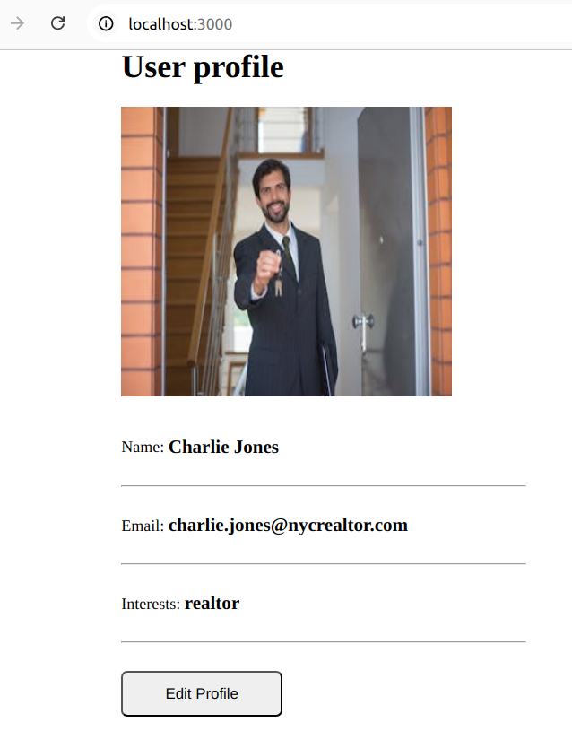
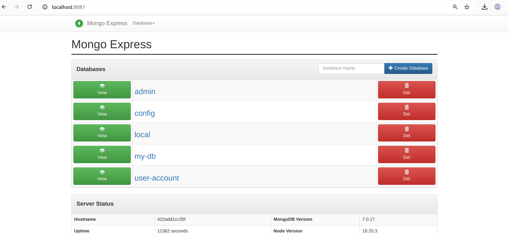

# Containerized NodeJs Application 

This guide explains how to deploy a NodeJs application using MongoDB and Mongo Express with the help of docker.

*Example of the Mongo Express UI showing databases.*



*Login page for Mongo Express.*



---

## Prerequisites

- Docker
- Node.js
- npm

## Steps to Run the Application

### 1. Clone the application repository and run the application

Run the following commands to clone the repository and start the application:

```bash
cd /
mkdir jsapplication
cd jsapplication/
git clone https://github.com/awaisdevops/docker-projects.git

npm install  # Install dependencies
node server.js  # Run the application
```

### 2. Pull the MongoDB Image

```bash
docker pull mongodb/mongodb-community-server
```

### 3. Pull the Mongo Express Image

```bash
docker pull mongo-express
```

### 4. Create Mongo Network

Create a dedicated network `mongo-network` that will be used by MongoDB and Mongo Express to communicate.

```bash
docker network create mongo-network
docker network ls  # List networks to verify mongo-network is created
```

### 5. Start MongoDB Container with Necessary Parameters

Run the MongoDB container with the following configuration:

```bash
docker run -d -p 27017:27017 --network mongo-network -e MONGO_INITDB_ROOT_USERNAME=admin -e MONGO_INITDB_ROOT_PASSWORD=password --name mongodb mongodb/mongodb-community-server
```

### 6. Start Mongo Express Container with Necessary Parameters

Run the Mongo Express container with the following configuration:

```bash
docker run -d -p 8081:8081 -e ME_CONFIG_MONGODB_ADMINUSERNAME=admin -e ME_CONFIG_MONGODB_ADMINPASSWORD=password --net mongo-network --name mongo-express -e ME_CONFIG_MONGODB_SERVER=mongodb -e ME_CONFIG_BASICAUTH_USERNAME=mexpress -e ME_CONFIG_BASICAUTH_PASSWORD=mexpress mongo-express
```

### 7. Access MongoDB via Mongo Express through Browser

Open a browser and navigate to the following URL to access Mongo Express:

```
http://localhost:8081/
```

Use the credentials `mexpress` for both the username and password to log in.

### 8. Create a New Database via Mongo Express UI

1. Open Mongo Express
2. Log in
3. Click on **Databases**
4. Click **Create Collection**
5. Enter the Collection Name
6. Click **Save**

For this example, create a database named `user-account`.

### 9. Configure Node.js Application Code to Connect with the Database

#### a. Install Dependencies

Install the MongoDB Native Driver:

```bash
npm install mongodb
```

#### b. Set Up the Connection

Use the following code to connect your Node.js application to MongoDB using the native driver:

```javascript
const { MongoClient } = require('mongodb');
const url = 'mongodb://localhost:27017';  // MongoDB URI
const dbName = 'your-database-name';

async function main() {
  const client = new MongoClient(url, { useNewUrlParser: true, useUnifiedTopology: true });
  try {
    await client.connect();
    console.log('Connected to database');
    const db = client.db(dbName);
    // Perform operations...
  } catch (err) {
    console.error('Error:', err);
  } finally {
    await client.close();
  }
}

main();
```

#### c. Run the Application

To run the application, use the following command:

```bash
node app.js
```

If successful, you'll see the output: `Connected to MongoDB`.

---

## License

This project is licensed under the MIT License - see the [LICENSE](LICENSE) file for details.
